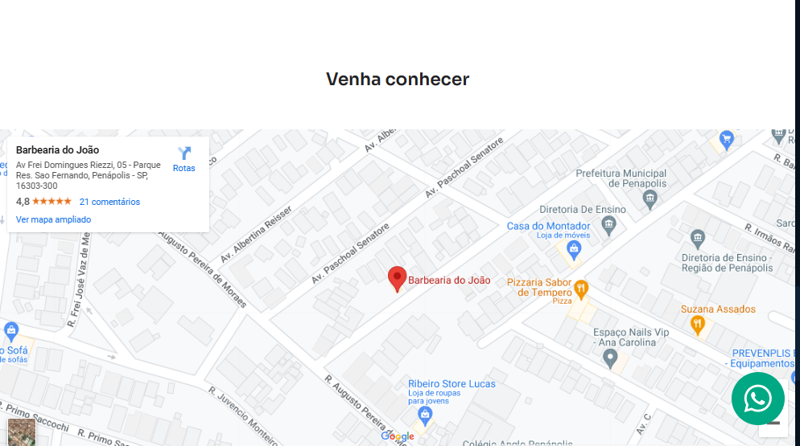
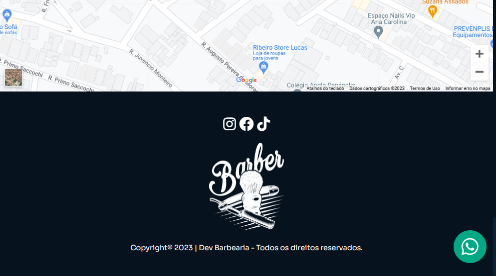

## Landing Page de uma Barbearia

 

  
   
  
   
  
    
  
    
  

 
 

> Descrição

Projeto construído na aula do canal do [Sujeito Programador](https://youtu.be/Fzc_dnqD-V0) no youtube.

[🔗 Clique aqui para acessar o projeto](https://hugolinobg.github.io/BarberDev/)

## 🚀 Tecnologias

Esse projeto foi desenvolvido com as seguintes tecnologias:

- HTML
- CSS
- Sass
- AOS - Animate On Scroll Library
- Figma
- Git
- Github

## ✉️ [Contato](https://hugolino.dev)

hugolino2609@gmail.com
